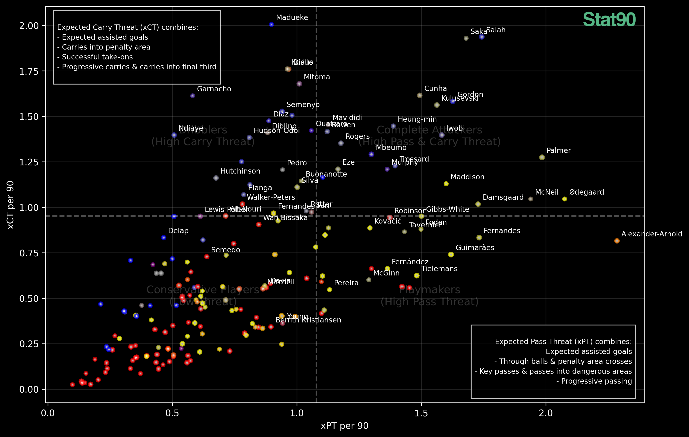

The fundamental question in football analytics has always been: "What do players do when they have the ball?" Traditional statistics like assists and key passes tell part of the story, but they often miss the nuanced ways players influence the game. A player making consistent passes into dangerous areas or carrying the ball past defensive lines might not register traditional creative statistics, yet their actions consistently create threatening situations.

This led us to develop two new metrics - Expected Pass Threat (xPT) and Expected Carry Threat (xCT) - that aim to capture the full spectrum of a player's on-ball actions. Instead of just measuring end products like assists, these metrics evaluate every meaningful offensive action a player makes with the ball.

Consider this scenario: Player A makes five passes into the final third, while Player B makes two passes into the penalty area. Which player created more threat? To answer this objectively, we needed a baseline metric. We chose Expected Assisted Goals (xAG) as our foundation, using it to weight different actions based on how frequently they translate to actual creative output.

[INSERT: Brief example of how specific actions translate to xAG]

## The Two Dimensions of Threat

Let's dive straight into our main analysis. The visualization below plots every Premier League player's Expected Pass Threat (xPT) against their Expected Carry Threat (xCT), both measured per 90 minutes:

The plot divides players into four distinct profiles:

1. **Complete Attackers** (Top Right): Players who excel at both passing and carrying threat
2. **Dribblers** (Top Left): Specialists in carrying threat who create danger through dribbling and progressive carries
3. **Playmakers** (Bottom Right): Traditional creators who primarily threaten through their passing
4. **Conservative Players** (Bottom Left): Players who typically operate in less threatening areas or have more defensive responsibilities

### Position Clusters and Playing Styles

[INSERT: Analysis of how different positions cluster in different areas]

What's particularly interesting is how players in the same position can have vastly different profiles. Let's look at some specific examples:

[INSERT: 2-3 examples of players in same position with different profiles]

### Team Case Study: [Team Name]

[INSERT: Analysis of one team's players and their distribution]

### Comparing Elite Creators

For players clustered in similar areas, we can break down their profiles further:

[INSERT: Radar chart comparing similar players]

## Top Performers

Let's look at the players leading in each metric:

### Top xPT Performers
[INSERT: Bar chart and analysis]

### Top xCT Performers
[INSERT: Bar chart and analysis]

## Technical Methodology

Now let's dive deeper into how these metrics are calculated.

Expected Pass Threat (xPT) combines several passing metrics, each weighted based on their correlation with xAG:
[INSERT: Full xPT calculation breakdown]

Expected Carry Threat (xCT) similarly weights carrying actions:
- Carries into Penalty Area: 0.180x xAG
- Successful Take-ons: 0.136x xAG
- Carries into Final Third: 0.086x xAG
- Take-on Attempts: 0.059x xAG
- Progressive Carries: 0.058x xAG

### Limitations

It's important to note that our weighting system looks at correlation rather than causation. While we can't track sequential actions within possessions, we believe this approach provides the best approximation given available data. We specifically chose positive attacking metrics that logically connect to threat creation, providing a robust framework for evaluation.

## What's Next?

While this analysis focuses primarily on creative roles, we're working on similar frameworks for other positions. Our next deep dive will look at the modern "6" role, analyzing how defensive midfielders influence the game through their on-ball actions.

[INSERT: Any closing thoughts or specific findings you'd like to highlight]