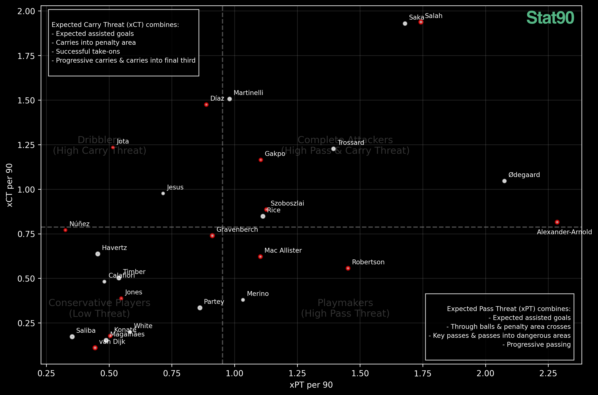

We start with the fundamental question: "What do players do when they have the ball?" Traditional statistics like assists and key passes tell part of the story, but they often miss the nuanced ways players influence the game. A player making consistent passes into dangerous areas or carrying the ball past defensive lines might not register traditional creative statistics, yet their actions consistently create threatening situations.

This led us to develop two new metrics - Expected Pass Threat (xPT) and Expected Carry Threat (xCT) - that aim to capture the full spectrum of a player's on-ball actions. Instead of just measuring end products like assists, these metrics evaluate every meaningful offensive action a player makes with the ball.

## The Two Dimensions of Threat

Let's dive straight into our main analysis. The visualization below plots every Premier League player's Expected Pass Threat (xPT) against their Expected Carry Threat (xCT), both measured per 90 minutes:

The plot divides players into four distinct profiles:

1. **Complete Attackers** (Top Right): Players who excel at both passing and carrying threat
2. **Dribblers** (Top Left): Specialists in ball carrying who create danger through beating their man and carrying the ball into dangerous areas.
3. **Playmakers** (Bottom Right): Traditional creators who primarily threaten through their passing
4. **Conservative Players** (Bottom Left): Players who typically operate in less threatening areas or have more defensive responsibilities

### Position Clusters: Breaking Down the Playing Styles

The scatter plot reveals fascinating patterns in how different positions and roles cluster together, often challenging traditional positional classifications.

#### Creative Midfield Hubs
In the upper-middle region between Complete Attackers and Playmakers, we find an elite cluster of traditional "number 10s" and creative attacking midfielders. **Cole Palmer**, **Martin Ødegaard**, **Bruno Fernandes**, and **James Maddison** form a distinct group, all demonstrating balanced threat creation through both passing and carrying.

Two particularly interesting findings emerge here:
1. **Mikkel Damsgaard** and **Dwight McNeil** are positioned right among these elite creators, suggesting they might be undervalued for their creative contributions
2. **Phil Foden**** appears slightly left of this cluster, indicating a potential dip in his creative output compared to his previous season's form where he would typically profile as a Complete Attacker

#### Deep-Lying Playmakers and Creative Fullbacks
Lower in the Playmaker quadrant, we find an intriguing mix of positions. Deep-lying midfielders like **Enzo Fernandez** and **Youri Tielemans** cluster together, but what's particularly noteworthy is how they're joined by attacking fullbacks such as **Pedro Porro**, **Andy Robertson**, and **Pervis Estupiñán**. This suggests modern fullbacks are taking on significant creative responsibilities, matching the threat creation of traditional midfield playmakers.

#### The Dribbling Specialists
The Dribblers quadrant showcases players who excel at progressing the ball through carries. **Noni Madueke** stands out significantly here, posting the highest carry threat numbers in the league. Just below him, we find an interesting cluster including **Mohammed Kudus**, **Kaoru Mitoma**, and **Amad Diallo**, the latter's positioning reflecting his excellent recent form.

A notable outlier in this quadrant is **Alejandro Garnacho**, who shows strong carry threat but unusually low passing threat for his position.

#### Complete Attackers: The Elite Creators
The Complete Attackers quadrant is headlined by two standout performers: **Mohamed Salah** and **Bukayo Saka**, who are significantly ahead of their peers in both metrics. Behind them, we find a group of creative wingers including **Dejan Kulusevski**, **Son Heung-min**, **Anthony Gordon**, and **Matheus Cunha**, all demonstrating the modern winger's requirement to both create and progress the ball.

### Team Case Study: Liverpool vs Arsenal - Comparing the Title Challengers

The scatter plot reveals fascinating parallels and key differences in how the Premier League's top two sides create threat through their players' on-ball actions.

#### Elite Wide Creators
Both teams are anchored by exceptional wide forwards who dominate the Complete Attackers quadrant. Salah and Saka stand out as their teams' primary threats, posting remarkably similar numbers in both passing and carrying metrics. This is no coincidence – both players are crucial to their teams' attacking structures, capable of both progressing the ball and creating chances.

#### Primary Playmakers: The Unconventional Comparison
One of the most interesting parallels comes in each team's main passing threat creator, though through very different positions. Arsenal relies on **Martin Ødegaard**, a traditional attacking midfielder, while Liverpool gets similar creative output from **Trent Alexander-Arnold**, nominally a right-back. 

#### Mirror Images on the Wing
The similarities continue in how both teams utilize their left-sided attackers. **Luis Díaz** and **Gabriel Martinelli** show comparable profiles, both featuring high carry threat metrics that reflect their direct dribbling styles. Meanwhile, **Gakpo** and **Trossard** represent more balanced options for their respective sides, posting moderate numbers in both passing and carrying threat metrics.

#### Midfield Dynamics: Liverpool's Advantage
The key differentiation between these sides emerges in midfield threat creation. Liverpool shows greater depth here, with **Gravenberch**, **Szoboszlai**, and **Mac Allister** all clustering around the median intersection of the quadrants. This indicates a midfield that can both progress the ball and create chances from multiple positions. Arsenal, in contrast, shows more specialized profiles – **Declan Rice** stands as their only midfielder in this central zone, with **Thomas Partey** and **Mikel Merino** showing notably lower carrying threat.

#### Surprising Findings
The data reveals some unexpected insights about key players. Both **Kai Havertz** and **Darwin Núñez** show surprisingly low direct threat creation numbers despite their advanced positions. This suggests their value to their teams might come through off-ball movement and other aspects not captured by on-ball metrics.

### Limitations

It's important to note that our weighting system looks at correlation rather than causation. While we can't track sequential actions within possessions, we believe this approach provides the best approximation given available data. We specifically chose positive attacking metrics that logically connect to threat creation, providing a robust framework for evaluation.

Another crucial consideration is the distinction between a player's inherent abilities and their tactical role within a team. The metrics we've developed primarily capture how players are utilized within their team's system rather than their complete skill set. This is particularly evident in our Arsenal-Liverpool comparison, where players with different natural playing styles cluster together due to similar tactical responsibilities:
- **Luis Díaz** and **Gabriel Martinelli** show similar threat profiles despite their different technical attributes, reflecting how both teams use their left-sided attackers
- **Martin Ødegaard** and **Trent Alexander-Arnold** emerge as comparable creative threats despite being very different types of footballers, highlighting how Liverpool have adapted the right-back position to serve a playmaking function
- Even **Mohamed Salah** and **Bukayo Saka**, while both elite wide forwards, achieve similar threat metrics through notably different playing styles

These clusters tell us more about tactical roles and team structure than they do about individual player characteristics. A player might show lower threat metrics not due to limited ability, but because their team requires them to perform different functions within the system.

## What's Next?

This analysis represents an attempt to quantify how players create danger when they have the ball. While these metrics aren't perfect, they offer one way to understand the different styles and approaches players use to influence the game, from Alexander-Arnold's unique passing profile to the contrasting midfield structures of title contenders.

In future posts, we'll explore other aspects of the game, including a deep dive into the modern "6" role and how defensive midfielders influence play through their on-ball actions.

If you'd like to follow our work and stay updated with more analysis like this, you can find us on:
- Instagram: [@stat90hq](https://instagram.com/stat90hq)
- Bluesky: [@stat90.bsky.social](https://bsky.app/profile/stat90.bsky.social)